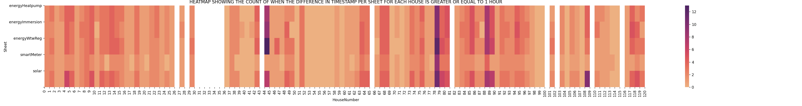
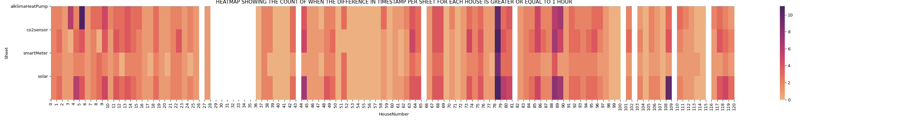

# Portfolio_minor_ADS
Name: Niels van Drunen
Student number: 18062814
## Index
1) Global View of Contributions
2) Datacamp Courses
3) Project Introduction
4) Domain Knowledge
5) Data Collection
6) Data Preperation & Visualisation
7) Predictive Models 
8) Evaluation
9) Diagnostics of the Learning Process
10) Communication

### 1. Global View of Contributions
I have,
1) done all of the mandatory Datacamp courses prescribed by the minor, together with the first part of another course we found along the way: 2/4 chapters of Introduction to Deep Learning with PyTorch (chapter 2).
2) done most of the external presentations.
3) set up a starting document  for our group containing basic information on the topic of our goals and deadlines to be met.
4) led most of our conversations with our problem owner, informing him about our progress using Microsoft Sway (chapter 11) and asking for his opinion.
5) been navigator many times whilst working on the SVR, MLP and LSTM. Which means my task was to search for information on the code the driver is writing. This proved to be a highly efficient way of writing code in duos (chapter 8).
6) been driver when we first started on a MVLR on energy production, the results of this are displayed and discussed in chapter 8.
7) worked together with Levy on finding various ways to verify our model’s performance by doing a literature study on for example various Loss Functions (chapter 8). 

### 2. Datacamp Courses
Below is a screenshot of the mandatory courses I had to follow for this
minor, as you can see almost all of them I completed after the due date
was met. I usually completed them in the week after the due date. This was
probably caused by delay I received in the first week of the minor, hence
the 1 week divergency. Obviously this is not the right way to deal with
delay, but due to the work pressure of the minor besides the Datacamp
courses it ended up being this way.

On the side I also did the first 2 chapters of the course Introduction to
Deep Learning with Pytorch, which is a course that was advised by one of
our teachers to help getting familiar with Neural Networks. 

### 3. Project Introduction
In this chapter the main goal and findings of the project I contributed to
will shortly be discussed. For the planning of the project however I would
like to refer to the chapter ‘Planning & Deadlines’ in .
The problem the team has to solve is offered by the company Factory Zero,
delivered to us by the problem owner Salcedo Rahola Baldiri. The company 
Factory Zero has the goal to create sustainable residential houses that 
generate equally as much energy as the produce on a yearly basis. In order 
to guarantee their customers that their house is truly "zero at the meter" 
the company wanted to find a way in which effectively predict the energy 
production & consumption of one such NZEB (short for net zero emission building). 
The data received by the team consists of all the meter data trasmitted from 
the intregrated Climate Energy Modules (iCEM) from each of the 120 (identical) 
NZEBs located in Zoetermeer (Zuid Holland, Netherlands) from the year 2019, 
more on this in chapter 4. This resulted in the following research question:

*What is a suitable machine learning model to predict energy use &
production of a “zero at the meter” residential house, one day in advance
with (if possible) hourly resolution?*

The team then went on to find literature  on the topic of
predicting residential energy consumption & production to find suitable
models to try out. The following models were implemented: MVLR (Multi Variate
Linear Regression), SVR (Support Vector Regression), LSTM (Long Short-Term
Memory) and MLP (Multi-Layer Perceptron).
The conclusion of the project is that out of the 4 models LSTM the best
predictions makes for both energy production & consumption. More on the
exact performances of the models in chapter 8 Predictive Models. However
there are still a couple of things left to experiment with, for example
using a simple classification model to classify peaks in the consumption
data and then feeding the non-peak data and peak data to 2 separate models
to make a better prediction.

### 4. Domain Knowledge
In order to do qualitive research on which models are suggested by
external sources, it is important to first identify clearly what kind of
model is needed in order to answer the team’s research question. Our goal
is to predict 1 day ahead the energy production & consumption of a NZEB,
short for net zero emission building, thus a time-series based regression model is 
required in any case. The team then decided that everyone should try to find 
about 5 articles and place them in the Excel file I referred to earlier
, together with a short summary 
of the contents. The document reveals that I have found the following articles:
1) *Machine Learning-Based Approach to Predict Energy Consumption of Renewable and Nonrenewable Power Sources*
> Researchgate
2) *Predicting Energy Consumption of a House using Neural Network*
> Researchgate
3) *Forecasting Energy Consumption of a House using Radial Basis Function Network*
> Researchgate
4) *A granular deep learning approach for predicting energy consumption*
> Researchgate
5) *Predicting energy consumption: A multiple decomposition-ensemble approach*
> Researchgate

My intent was to see whether it was worthwhile to try contact the authors of 
the papers via ResearchGate for the papers, which turned out to be not the case.
After about a week of waiting and no response I then went on to try and find the 
papers elsewhere via Google Scholar, which I was succesful in and found an exact 
copy of the papers far more easily available on Sciencedirect. In both papers 2 
and 4 LSTM is mentioned as being a succesful candidate when it comes to predicting 
energy consumption, according to paper 1 SVR & MLP are also worth trying out. And 
when we noticed that multiple other papers also mentioned these models we decided 
to put them to the test. And as final addition to the list of models to try out 
MVLR was added, due to a tip from one of our teachers. 

In order to gain a basic understanding of how the iCEM (integrated energy control module) works 
from which we receive our data to train our models on the team was given the following 2 reports 
by our problem owner:
- 
- 

An important conclusion that was derived from these reports is that in order 
to predict energy consumption a short calculation has to be done:
> Energy Consumption = Smart_in + Solar_out − Smart_out

This is due to the fact the total amount of electricity that enters the NZEB is 
the sum of what is generated by the solar panels (Solar_out) and what comes from 
the net (Smart_in). Hence if one is to calculate the total energy consumed by the 
NZEB, the total energy deliverd by the NZEB to the net (Smart_out) is subtracted 
from the total energy delivered to the NZEB (Smart_in + Solar_out). The exact 
components of one such iCEM are not important for our project and will not be 
further discussed, but can be found in the earlier mentioned 2 reports. 

### 5. Data Collection
As mentioned earlier in chapter 3 the team received data from 120 identical NZEBs 
located in Zoetermeer (Zuid Holland, Netherlands) from the year 2019. This data was 
delivered to the team in the form of 120 Excel files each containing several 
worksheets, 1 for each integrated meter in the iCEM. For the energy production of 
the house only the worksheet Solar was of importance, from which the feature Solar_out 
was extracted, representing the total energy produced by the NZEB. For energy consumption 
2 worksheets were of importance, that of the SmartMeter and that of Solar, due to the 
calculation that has to be made for energy consumption as mentioned in the last chapter. 

Me and my team did a brainstorm session for each of the datasets for energy production & consumption where we discussed what kind of features could be of use and made several correlation matrices to see which of the features were best to use *ins link to notebook*

### 6. Data Preperation & Visualisation
During the first 7 weeks of the minor the main tasks we focussed on were that of the 
weekly tasks our problem owner gave to us and finding literature. These tasks concerned 
things like visualising the production & consumption data in order to see whether on a 
yearly scale the houses were truly 'net zero'. We also discussed things like the 
appropriate resampling method, where we learned that there is a difference in 
resample().mean() and resampe().sum() etc. During these first few weeks the team was 
often more busy with Datacamp and getting familliar with the data, and back then we 
did not split up tasks too much yet. The tasks that were split up and given to me, 
or for a great part to me, I will discuss here. Aswell as the other visualisations 
and help I offered with data preparation after week 8 of the minor when the team 
started working on models.

When we first started analysing the data we discorvered that there were huge spikes in the data, timestamp gaps that would sometimes cover a couple of days 

#### 6a Heatmap
Nearing week 8 of the minor the team started moving towards making our first model, 
which would be a MVLR SVR. In order to know which houses to use for our dataset we 
had to get a clear overview of the amount of inconsistencies within the data per house. 
We decided to do this through making a heatmap of the columns within the worksheets we 
thought were perhaps useful for energy production at the time. Together with my teammate 
Levy Duivenvoorden we made the following notebook [Heatmap_production](Heatmap_np.pdf) which 
contains the code for the first heatmap we made, where we also showed the houses that are 
now left out (marked white) due to too high quantity of timestamp gaps greater than 1 hr shown below

The final heatmap we made for production is desplayed below.

In the code I am mostly responsible for adjusting the appearance of the heatmap by 
selecting the best colormap, also making sure its readable by adjusting the axis. 
During the making of this heatmap I was navigator, thus meaning I was busy looking 
things up such as making a heatmap in seaborn, how to adjust heatmap axis in seaborn, 
what colormaps there are available etc.

Once we started working more with energy consumption in week 11 we also wanted a heatmap to be made, 
this time since I already had most of the code I copied most from last notebook and selected different 
columns to display. From this notebook [Heatmap_consumption](W11_Heatmap_np_Consumption.pdf) the final heatmap is shown below.

### 7. Predictive Models

### 8. Evaluation

### 9. Diagnostics of the Learning Process
One of my prime objectives this minor was to gain more experience with programming in Python, 
which I believe I have achieved succesfully. I have learned a lot about both machine learning 
and neural network models and helped to design them. I practiced with presenting infront of 
a wide audience this minor, which is always welcome. I also learned to master the Navigator 
& Driver code writing method, where I learned to both code properly and effectively search for 
answers on the web. However I do believe that I have backed down slightly from being the Driver 
due to other teammates being more enthusiastic. During the minor I also was assigned the role 
of semi-chairman, which means I had to be the go-to contact person for external & internal 
sources and lead the conversations with them. According to the feedback I received during the 
360% feedback sessions that me and my team had at the start and near the end of the minor I 
learned that I still do have to keep practicing with correctly guiding the conversation with 
the problem owner for example. I think the following points were my strengths/weaknesses during 
this project:

(+) Easy to contact and open for feedback

(+) Dedicated to the team effort, making sure everyone is in good spirit

(+) Always ready to push himself to the limit when asked to

(-) Tends to deviate from the topic often during meetings with the problem owner

(-) Has to practice setting goals for himself and learn to achieve them effectively on a more personal level outside of the team effort

(-) Tends to fall to the background in big group efforts

### 10. Communication
During this minor I have done all of the public presentations [Public Presentation week 4](Public_Presentation_week_4.pptx), 
[Public Presentation week 8](Public_Presentation_week_8.pptx), [Public Presentation week 12](Public_Presentation_week_12.pptx). 
I also did the open presentation [Open Presentation](Open_presentation_07-01-21.pptx) 
and lunch presentation at the TU Delft [Lunch presentation_TU_Delft](Lunch_presentation_TU_Delft_14-12-20.pptx) 
near the end of the minor together with my colleague Levy Duivenvoorden. I wanted to do 
this because I wanted to reach an audience from which you do not always know what kind 
of questions you can expect, which helps with creating a more open mindset. The tactic 
me and my team had was that the one who presents will be the one to make the presentation, 
however there was a moment for feedback usually on the day of the presentation after the 
daily stand-up. When presentations were done with 2 people it was often split up in 2 
parts, for which both students were individually responsible for making the slides etc. 
In both dual presentations I ended up introducing the topic, explaining what models we 
applied and what our data looked like. Levy would then show the results and close the 
presentation.

Another form of communication I had to attend to were the weekly meetings with our 
problem owner Salcedo Rahola Baldiri. After week 7 until week 15 my task was to make 
MC Sway online files through which to briefly present our progress with to our problem 
owner. I also had to lead the conversation and whenever a topic was met that someone 
else had worked more on I had to make sure they got their time to explain their progress. 
Below is a table with the sway links for each week, though I must mention that these 
files can only be accessed through their URLs and there does not seem to be any other 
way in which to store them properly. Adding to this you must also log into your HHS 
microsoft account in order to get access, I want to apologise greatly for this inconvenience. 

Week | URL
-----|-----
7 | https://sway.office.com/Y3yBNdQVvj8LC8yH?ref=Link&loc=mysways
8 | https://sway.office.com/A99ggXV3vnFWfQoI?ref=Link&loc=mysways
9 | https://sway.office.com/FLRTo3mPuWw1Izuj?ref=Link&loc=mysways
10 | https://sway.office.com/BJVCOv5gPlFBvciM?ref=Link&loc=mysways
11 | https://sway.office.com/Lbpw4YyPIXtn65eV?ref=Link&loc=mysways
12 | https://sway.office.com/rt1wyP4MqHk8oOnT?ref=Link&loc=mysways
13 | https://sway.office.com/sEvhM5qpC4nLLkHp?ref=Link&loc=mysways
14 | https://sway.office.com/25SqetqrzpOTvsGl?ref=Link&loc=mysways
15 | https://sway.office.com/volb8rfWcG7HRCnX?ref=Link&loc=mysways

When it came to writing our paper I wrote a great part of the methodology concerning 
energy production. I also helped introducing where our data comes from (the part about the iCEM), 
and where we got weather data from in Data Collection. Adding to that I rewrote some parts 
of Data cleaning, mainly to make the text more compact but also adding information such as 
that we flattened some of the negative consumption data to 0 and why we did so. I also 
added to the chapter Data Cleaning the reason why we selected only 10% of the data to test on.
I also wrote a great part of the introduction that was about the former research we studied 
and why according to our sources we believe its worth trying out the models that we did (MVLR, SVR, LSTM, MLP).
