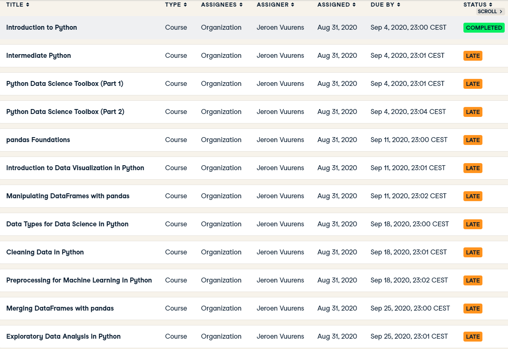

# Portfolio_minor_ADS
Name: Niels van Drunen
Student number: 18062814
## Index
1) Global View of Contributions
2) Datacamp Courses
3) Research Project
4) Domain Knowledge
5) Predictive Models
6) Data Preperation
7) Data Visualisation
8) Data Collection 
9) Evaluation
10) Diagnostics of the Learning Process
11) Communication

### 1. Global View of Contributions
I have,
1) done all of the mandatory Datacamp courses prescribed by the minor, together with the first part of another course we found along the way: 2/4 chapters of Introduction to Deep Learning with PyTorch (chapter 2).
2) done most of the external presentations.
3) set up a starting document  for our group containing basic information on the topic of our goals and deadlines to be met.
4) led most of our conversations with our problem owner, informing him about our progress using Microsoft Sway (chapter 11) and asking for his opinion.
5) been navigator many times whilst working on the SVR, MLP and LSTM. Which means my task was to search for information on the code the driver is writing. This proved to be a highly efficient way of writing code in duos.
6) been driver when we first started on a MVLR on energy production, the results of this are displayed and discussed in chapter 5.
7) worked together with Levy on finding various ways to verify our model’s performance by doing a literature study on for example various Loss Functions (chapter 5). 

### 2. Datacamp Courses
Below is a screenshot of the mandatory courses I had to follow for this
minor, as you can see almost all of them I completed after the due date
was met. I usually completed them in the week after the due date. This was
probably caused by delay I received in the first week of the minor, hence
the 1 week divergency. Obviously this is not the right way to deal with
delay, but due to the work pressure of the minor besides the Datacamp
courses it ended up being this way.

On the side I also did the first 2 chapters of the course Introduction to
Deep Learning with Pytorch, which is a course that was advised by one of
our teachers to help getting familiar with Neural Networks. 

### 3. Research Project
In this chapter the main goal and findings of the project I contributed to
will shortly be discussed. For the planning of the project however I would
like to refer to the chapter ‘Planning & Deadlines’ in .
The problem the team has to solve is offered by the company Factory Zero,
delivered to us by the problem owner Salcedo Rahola Baldiri and resulted in
the following research question:

*What is a suitable machine learning model to predict energy use &
production of a “zero at the meter” residential house, one day in advance
with (if possible) hourly resolution?*

The team then went on to find literature  on the topic of
predicting residential energy consumption & production to find suitable
models to try out. The following models were implemented: MVLR (Multi Variate
Linear Regression), SVR (Support Vector Regression), LSTM (Long Short-Term
Memory) and MLP (Multi-Layer Perceptron).
The conclusion of the project is that out of the 4 models LSTM the best
predictions makes for both energy production & consumption. More on the
exact performances of the models in chapter 4 Predictive Models. However
there are still a couple of things left to experiment with, for example
using a simple classification model to classify peaks in the consumption
data and then feeding the non-peak data and peak data to 2 separate models
to make a better prediction.

### 4. Domain Knowledge
In order to do qualitive research on which models are suggested by
external sources, it is important to first identify clearly what kind of
model is needed in order to answer the team’s research question. Our goal
is to predict 1 day ahead the energy production & consumption of a NZEB,
short for net zero energy building, thus a time-series regression model is 
required in any case. The team then decided that everyone should try to find 
about 5 articles and place them in the Excel file I referred to earlier
, together with a short summary 
of the contents. The document reveals that I have found the following articles:
- *Machine Learning-Based Approach to Predict Energy Consumption of Renewable and Nonrenewable Power Sources*
> Researchgate
- *Predicting Energy Consumption of a House using Neural Network*
> Researchgate
- *Forecasting Energy Consumption of a House using Radial Basis Function Network*
> Researchgate
- *A granular deep learning approach for predicting energy consumption*
> Researchgate
- *Predicting energy consumption: A multiple decomposition-ensemble approach*
> Researchgate

My intent was to see whether it was worthwhile to try contact the authors of 
the papers via ResearchGate for the papers, which turned out to be not the case.
After about a week of waiting and no response I then went on to try and find the 
papers elsewhere via Google Scholar, which I was succesful in and found an exact 
copy of the papers far more easily available on Sciencedirect. 

In order to gain a basic understanding of how the iCEM (integrated energy control module) works 
from which we receive our data to train our models on the team was given the following 2 reports 
by our problem owner:
- 
- 

